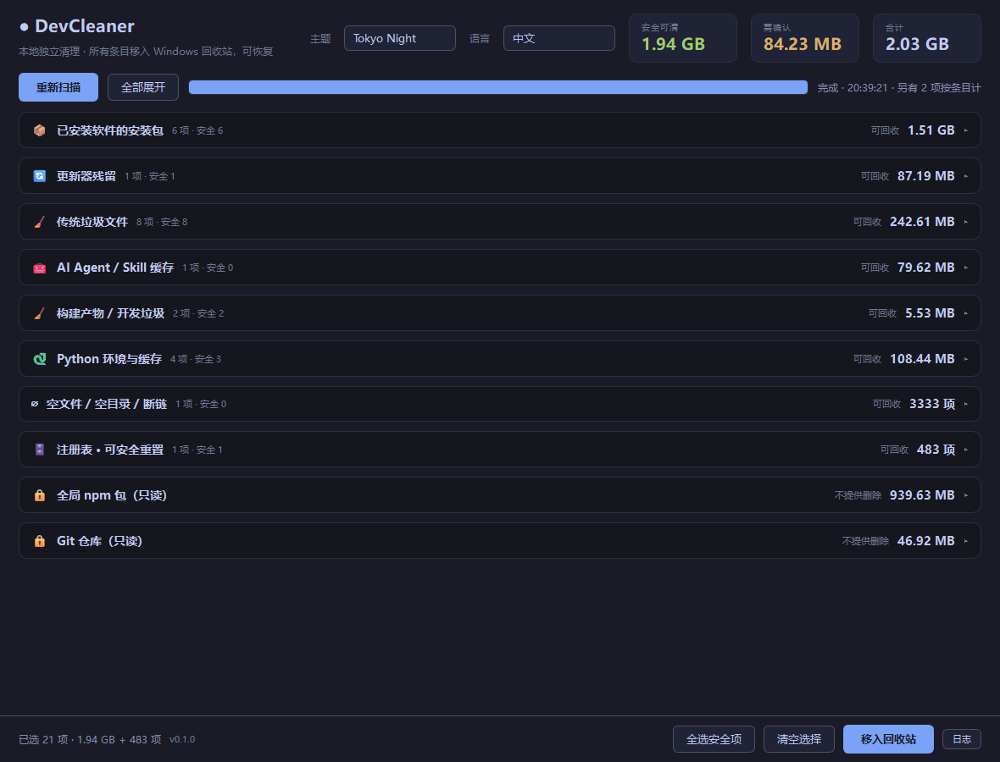
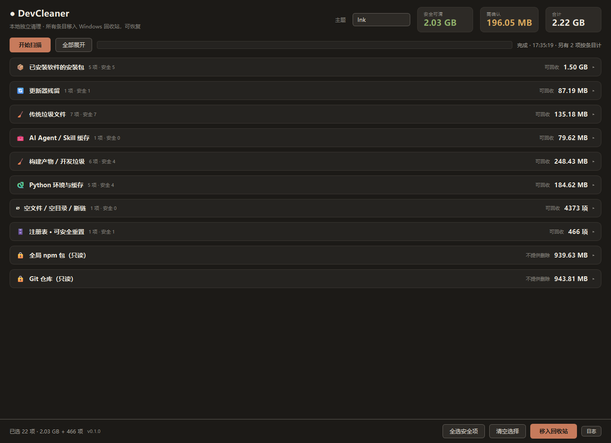
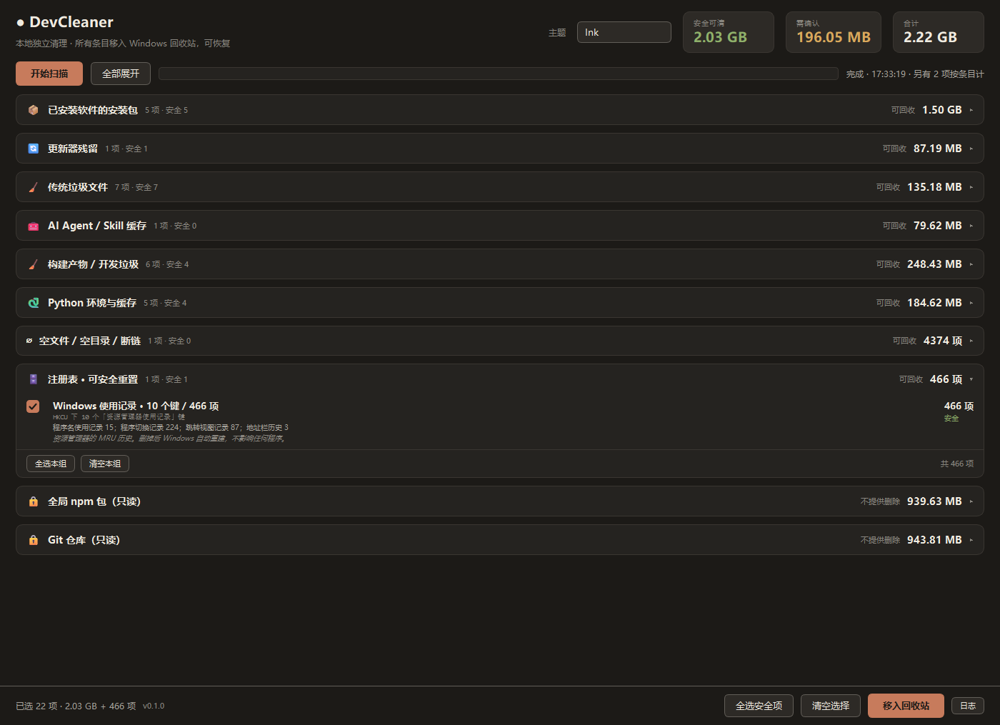

# DevCleaner

A local disk cleaner for Windows. Native window (PySide6), single-file exe. **Works fully offline — no browser, no Node, no Java, no external runtime.**

[](https://github.com/matou1118/DevCleaner/actions/workflows/ci.yml)
[](https://www.python.org/)
[](LICENSE)
[](https://learn.microsoft.com/windows/)

**Current version v0.2.0** · [中文](README.md) · [📖 Usage guide](docs/usage.en.md) · [📷 All screenshots](docs/Screenshots.md) · [Changelog](CHANGELOG.md) · [Contributing](CONTRIBUTING.en.md) · [Security](SECURITY.en.md)

Scanning starts the moment you open it. Categories are collapsed by default, so every category and its size fits on one screen. Expand the ones you care about, or hit "全部展开" (expand all).



> 📷 [More screenshots](docs/Screenshots.md): expanded view, confirmation dialog, registry section, all six themes
> 📖 [Full usage guide](docs/usage.en.md): every config key explained, troubleshooting, design trade-offs

## What it finds

| Category | How it decides | Measured on this machine |
|---|---|---|
| **Installers of already-installed software** | Strips version/platform/role suffixes off the filename to get a product name, then confirms "it's installed" using **three independent signals: running process, install directory, uninstall registry** | 6 items / **1.51 GB** |
| **Traditional junk files** | Thumbnail cache, jump lists, browser caches, shader caches, crash dumps, Windows Update cache… | 5 items / 51.6 MB |
| **Stale temp files** | Temp items untouched for N days; marked "caution" if a running exe lives in that directory | 0 items |
| **GitHub leftovers** | gh CLI / GitHub Desktop / Copilot caches; **local clones with no remote** (no remote + long idle + no uncommitted changes) | 0 items |
| **AI Agent / skill caches** | Packages not listed in `opencode.jsonc`'s `plugin` array; the stale copy when both `X` and `X@latest` exist | 1 item / 79.6 MB |
| **Updater leftovers** | `*@*-updater\pending\*`, `*\updates\executors\*`, … | 1 item / 87.2 MB |
| **Build artifacts / dev junk** | `build/` next to a `*.spec`; `__pycache__`, `.pytest_cache`, `.ruff_cache`, … | 6 items / 248 MB |
| **Python envs & caches** | `.venv` (only if `pyvenv.cfg` exists), pip cache, plus anything you add in config | 5 items / 182 MB |
| **Registry** | Uninstall entries and startup entries whose uninstall command points at a missing exe; plus safely-resettable MRU keys | 1 item / 466 entries |
| **Empty files / empty dirs / broken links** | 0-byte items, **automatically skipping `.gitkeep` / `*.lock` / `desktop.ini` / `Thumbs.db`** | 1 item / 4369 entries |

**Total: 2.22 GB reclaimable.**

### ⚠️ Three things worth being blunt about

1. **Registry cleaning barely frees space.** All the registry junk on this machine adds up to **15 KB**. Its value is removing dead references to programs that no longer exist — not freeing disk. That's why the UI counts *entries*, not bytes, for these.
2. **Empty files and empty dirs are the same.** They occupy 0 bytes. The value is tidiness, not space.
3. **Git repos are read-only by default — there's no delete button.** Nothing reliably distinguishes "throwaway clone" from "your active project". A repo only becomes deletable when **all three** hold: no remote configured, untouched for 60+ days, and no uncommitted changes. Everything else lands in a read-only list with its remote URL, so you can tell at a glance which clones are temporary.

### How "dead program" is decided

The single decisive signal is **the exe inside the uninstall command does not exist**.

An earlier version also required `InstallLocation` to be missing, and that produced a pile of **false positives** — WeChat and the Visual Studio Installer both still had their `Uninstall.exe` present; only their `InstallLocation` pointed at an old path. Deleting a live program's uninstall entry means you can never uninstall it again, which costs far more than the few KB you'd reclaim.

Such programs are no longer reported at all. Two tests guard this: one where the uninstall command is valid but `InstallLocation` is stale must **not** be reported, and one where the uninstall command is dead **must** be.

## Safety model

| Kind | Behaviour |
|---|---|
| Regular files | **Moved to a local backup directory** at `%LOCALAPPDATA%\DevCleaner\file_backups\<session>\`, restorable in one click for 7 days; expired sessions are purged at startup. v0.1.0 used the Recycle Bin — v0.2.0 does not |
| System directories | `to_recycle_bin` refuses outright to delete anything under `%SystemRoot%`, `%ProgramFiles%` or `%ProgramFiles(x86)%`. The paths come from the environment, so a Windows install on D: is protected too |
| Broken links | `os.rmdir`/`os.unlink` on the link itself only (it has no content) |
| **Registry** | **Exports a `.reg` backup first; if the export fails, it refuses to delete** |
| Bulk items | The confirmation dialog shows the item count and lists the first 40 by name |
| "Caution" items | Never pre-checked; you have to select them yourself |
| Software uninstall | Runs the software's own uninstaller → auto-scans for leftovers (folders / shortcuts / registry) → leftovers can be cleaned (files go through backup + rollback; registry entries are listed but not auto-deleted) |

File backups land in `%LOCALAPPDATA%\DevCleaner\file_backups\<session>\`, one `manifest.json` per session.
To roll back: pick a session in the UI and restore it in one click. If a file already exists at the original path that entry is skipped and reported — nothing is overwritten. The session directory is only deleted once every entry restored successfully; if anything fails the session is kept so you can try again.

Registry backups land in `%LOCALAPPDATA%\DevCleaner\registry_backups\<timestamp>_<type>\`.
To restore: `reg import "<path>"` on the `.reg` file in that directory.

DevCleaner **generates the `.reg` files itself** rather than shelling out to `reg.exe export` — `reg.exe`'s command-line quoting rules throw "invalid syntax" on paths containing spaces. Generating them directly is more predictable and faster. The test suite runs a full round trip: create key → back up → delete → `reg import` → verify the data matches.

## Deliberate limits

- **Doesn't touch fresh files in Windows Temp.** This machine's Temp is 770 MB, but *all of it* is under 7 days old, and 121 MB of that is a PyInstaller unpack directory for a program that is currently running. An age filter reclaims ~nothing here and risks deleting live temp files, so the default threshold is 7 days and in-use directories are skipped.
- **Doesn't touch Prefetch.** Deleting it makes the next boot slower. Net negative.
- **Doesn't scan system directories.** `C:/Windows`, `C:/Program Files`, `C:/Program Files (x86)` are allow-listed by default.
- **Never puts a Git repo with a remote in the deletable list.** There's a test specifically for this.

## Install

Grab `DevCleaner.exe` from [Releases](https://github.com/matou1118/DevCleaner/releases) and double-click it. Scanning starts automatically; closing the window quits.

Python 3.10+ is needed only to run from source or rebuild.

## Run from source / build

```bash
pip install -r requirements.txt

python app.py --version     # 0.2.0
python app.py                # headless: run a scan and print results
python app.py --json         # JSON output (for scripts)
python app.py -c "registry"  # run one category only
python gui.py                # native window
python test_app.py           # 76 self-checks
build.bat                    # self-check -> clean -> PyInstaller onefile -> copy config
```

## Configuration

`settings.yaml` sits next to the exe (a bundled copy is used if none is found there). **Restart to apply — no rebuild needed.**

```yaml
theme: "Ink"                # last selected theme

scan_roots:                    # roots that need recursive walking
  - "%USERPROFILE%"

installer_roots: []            # empty = auto-detect Downloads + Desktop

exclude_dirs:                  # never included in results
  - "C:/Windows"
exclude_globs:
  - "**/node_modules/**"

min_installer_age_days: 14     # "unconfirmed" installers must be at least this old
temp_min_age_days: 7
stale_clone_days: 60

installed_aliases:             # fallbacks when the uninstall registry misses
  OfficeAce: ["OfficeClaw"]

custom_cache:                  # drop any directory in here — zero code required
  - name: "pip download cache"
    path: "%LOCALAPPDATA%/pip/Cache"
    risk: safe
    note: "Re-downloads if needed."
```

`risk` is either `safe` (pre-checked) or `caution` (not pre-checked, needs confirmation).

## Themes

Six palettes, taken verbatim from [`docs/palette-directions.html`](docs/palette-directions.html) (the original design file):

| Direction | Dark | Light |
|---|---|---|
| **Studio** — the Linear / Vercel / Raycast lineage | Studio Dark | Studio Light |
| **Editorial** — magazine/print texture, warm paper and ink | Ink | Paper |
| **Curated** — community-standard palettes | Tokyo Night | Rosé Pine |

Switch live from the top-right dropdown; the choice is written back to `settings.yaml` and persists across restarts. To change the colours, edit the design file or `_PALETTES` in `app.py` — the rest of the tokens are derived.

### Derived tokens

The design file specifies 7 primary colours. Secondary/tertiary text, border brightness, and the colour of text on the accent background are **computed with the WCAG formula** rather than hand-copied — so they follow along when you change a primary colour.

"Text on accent" picks whichever of white / background colour has the higher contrast. That reproduces the design's choice for Studio, Paper, Rosé Pine and Tokyo Night. The one deviation is **Ink**: the mockup used white text (3.3:1), which fails WCAG AA's 4.5:1 for 13px bold, so the background colour is used instead (5.3:1).

A dedicated test measures this: all 7 contrast pairs per theme must pass (body text ≥ 4.5:1; tertiary text and caution ≥ 3:1).



## Adding a scanner

Subclass `Scanner` in `app.py`, implement `scan()`, and append it to the `SCANNERS` list. The UI grows a new collapsible group automatically — no UI code to touch.

```python
class MyScanner(Scanner):
    category, icon = "My category", "\U0001f9f0"

    def scan(self) -> List[Item]:
        return [mk(self.category, Path("C:/some/cache"), "name", "safe",
                   note="why it's safe")]
```

Set `Item.unit = "count"` to have the UI show an **entry count** instead of bytes, and to exempt it from the `min_size_bytes` filter.



## Roadmap

See [CHANGELOG.md](CHANGELOG.md) under "Unreleased". Highest priority:

- Scan only the categories you pick (currently it walks everything)
- Export scan results to a report file
- i18n for the UI text (currently hardcoded Chinese)

Open an issue to claim one.

## FAQ

**Q: Will it delete my project source?**
Git repos are **read-only** — there's no delete button. A repo only becomes deletable when it has no remote, is untouched for 60+ days, and has no uncommitted changes.

**Q: I deleted something by mistake. How do I get it back?**
File backups are in `%LOCALAPPDATA%\DevCleaner\file_backups\` — pick a session in the UI to roll it back, valid for 7 days. Registry backups are in `%LOCALAPPDATA%\DevCleaner\registry_backups\` — use `reg import` on the `.reg` there. Backups older than 7 days are purged at startup; after that a System Restore point or a file recovery tool is the only way back.

**Q: It only found 2 GB, but Temp alone is 770 MB.**
Everything in Temp is under 7 days old, and 121 MB of it is a PyInstaller unpack directory for a running process. An age filter reclaims nothing there and risks breaking live programs, so it's skipped by default.

**Q: The registry scan is only 15 KB. Is it even worth it?**
The value isn't disk space — it's clearing out references to programs that are already gone. The UI shows entry counts so it doesn't pretend otherwise.

**Q: Can I scan other drives?**
Edit `scan_roots` and `installer_roots` in `settings.yaml`. Be aware that adding many recursive roots makes the scan noticeably slower.

## Known limitations

- Deleting keys under `HKLM` (system uninstall entries, the `Run` branch) requires administrator rights. A non-elevated run reports "insufficient permission" — that's expected.
- Git repos in the read-only list have no "delete all" shortcut; you decide per repo.
- Registry scanning is limited to 10 MRU keys under `HKCU` plus three `Uninstall`/`Run` branches. It deliberately does **not** walk `HKCR\CLSID` and friends — a mistake there can make Windows unable to install programs.
- Scan time scales with disk size and file count. ~25 s across 24 volumes here, about 11 s of which is the full empty-file/dir walk.
- The empty-files category is aggregated into a single row (4369 rows would be unusable); cleaning expands it into per-item deletes.
- UI text is hardcoded Chinese.

## Support this project

If it saved you some time:

- ⭐ Star it so more people find it
- 🐛 [Open an issue](https://github.com/matou1118/DevCleaner/issues) for bugs or new categories
- 💬 Share it with anyone else annoyed by installer files and temp clutter
- 💰 [GitHub Sponsors](https://github.com/sponsors/matou1118) to support maintenance

**Donations aren't needed right now.** The author built this on their own machine, wrote down the reasoning in the [decision log](CHANGELOG.md), and it started as a personal itch. If it helped you, a star or a piece of feedback is worth more than money.

## License

## License

**[CC BY-NC 4.0](LICENSE) — attribution (Matou1118), non-commercial**

- **You may** modify it, build on it, ship your own version
- **You must** credit Matou1118, keep the licence notice, and say whether you changed it
- **You may not** use it commercially - a free fork is fine; selling it, bundling it
  into a paid product, or monetising it with ads is not
- If unsure, [open an issue](https://github.com/matou1118/DevCleaner/issues) and ask
