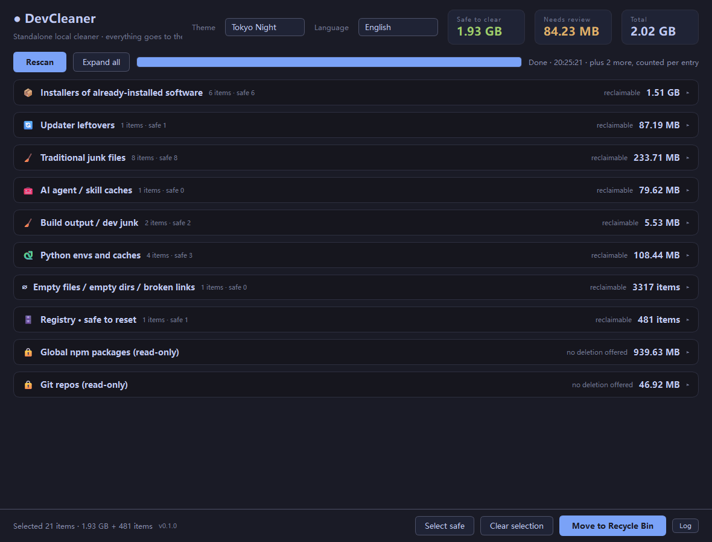
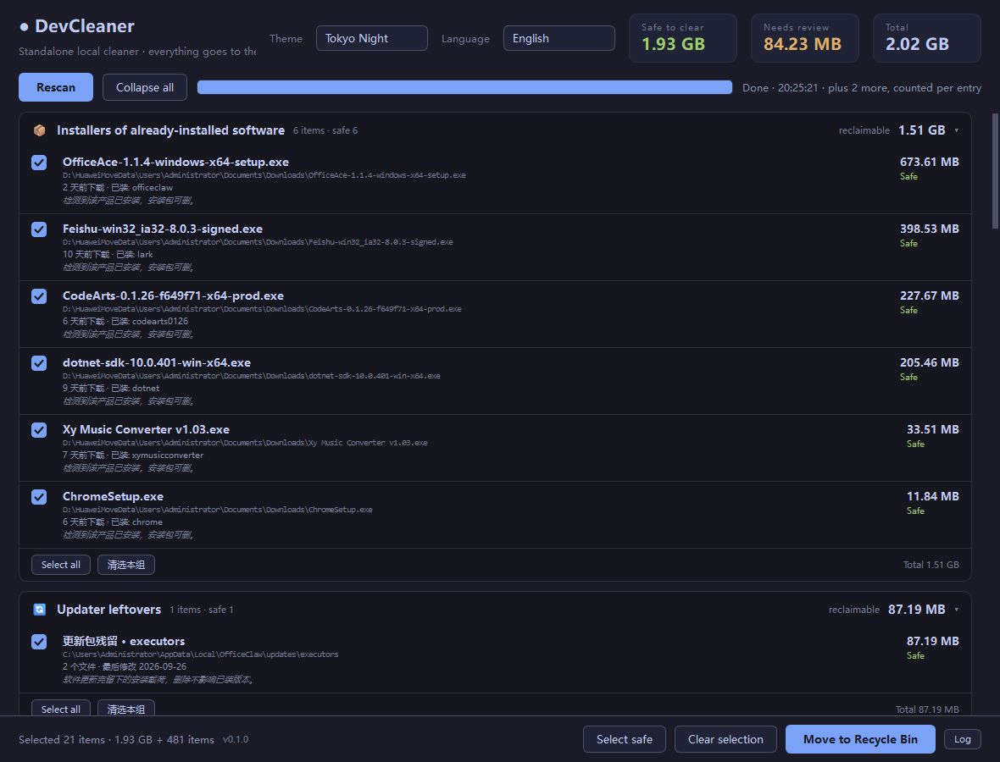
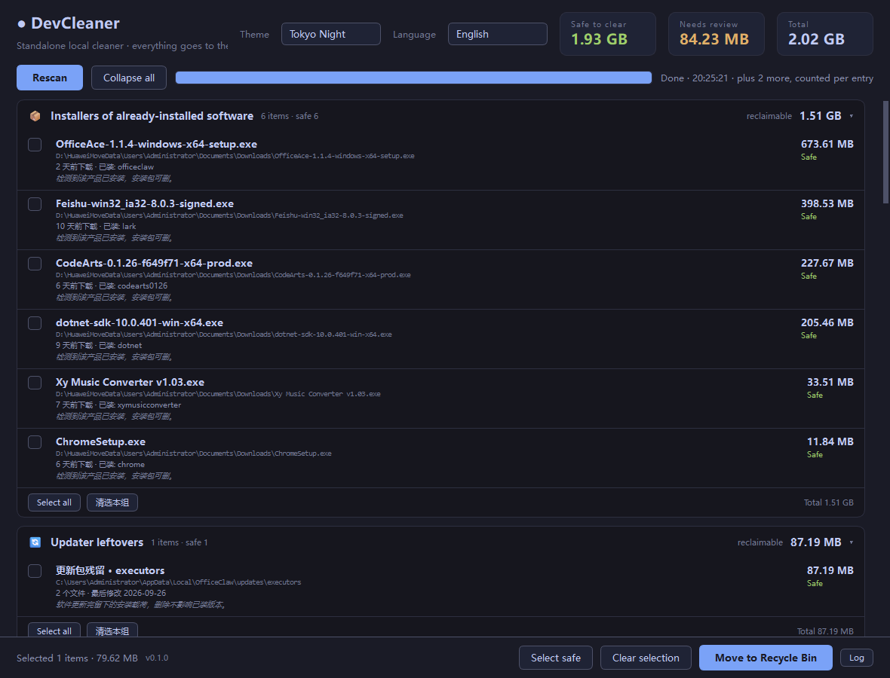
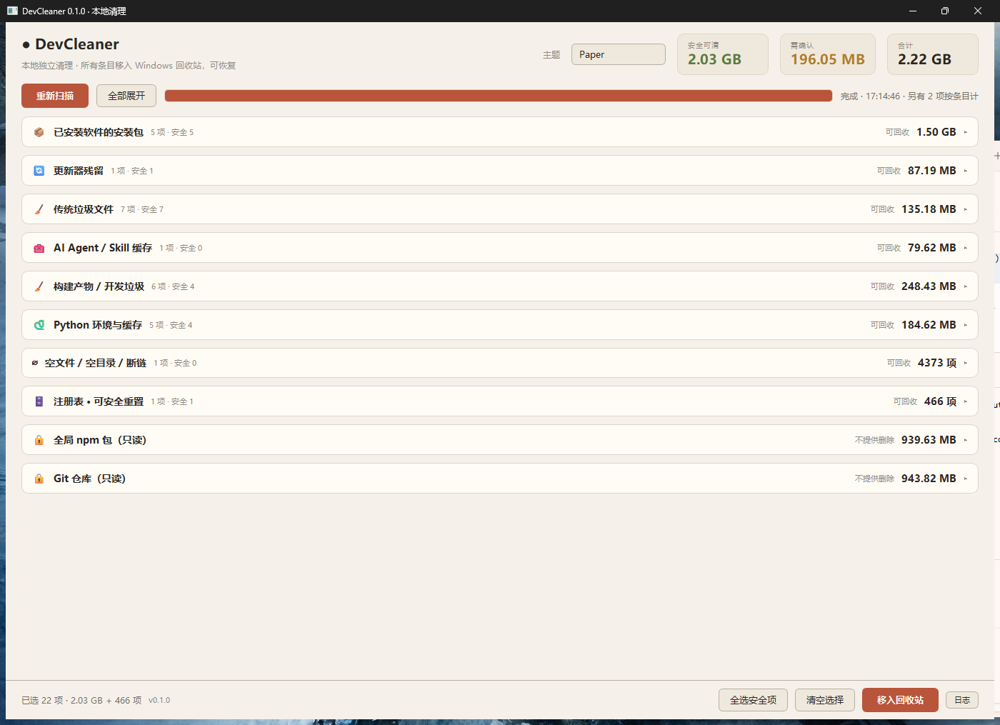
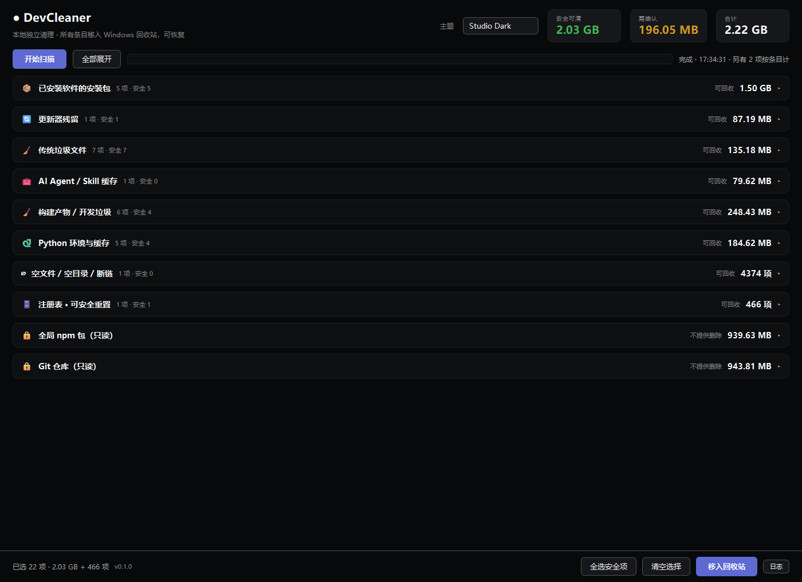
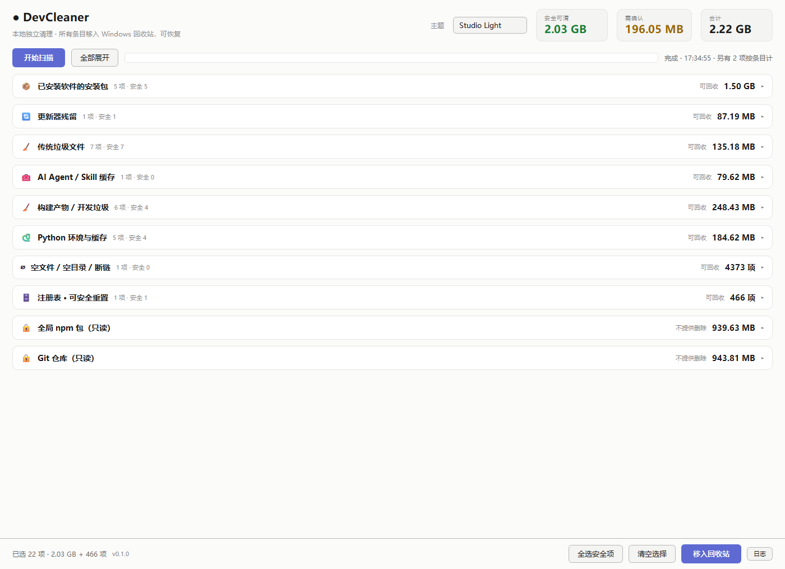
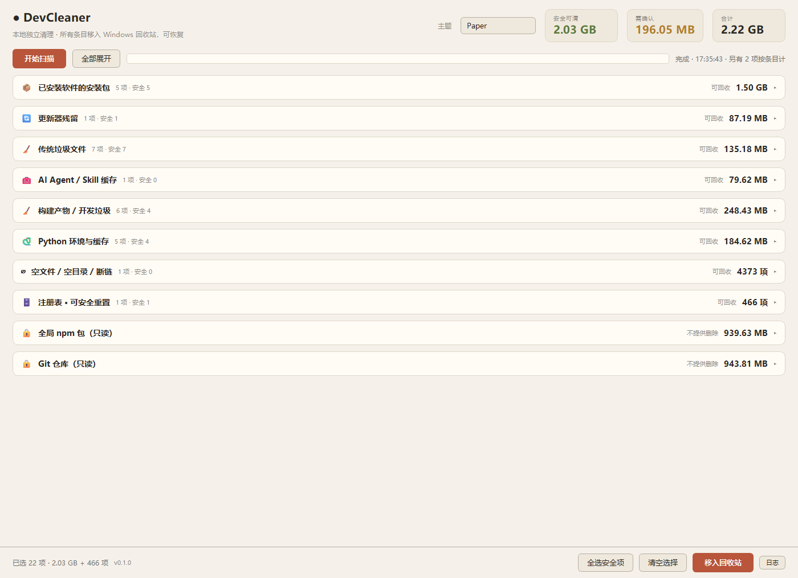
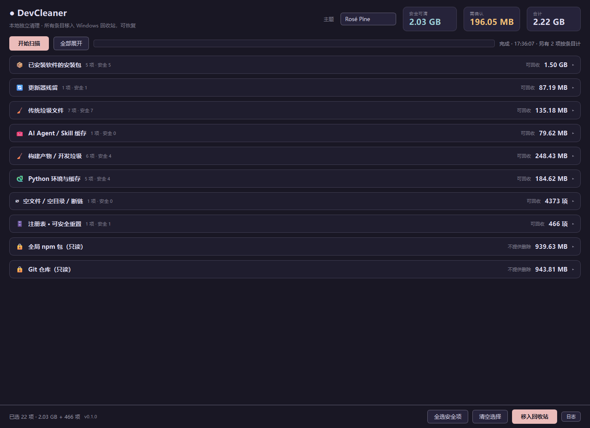
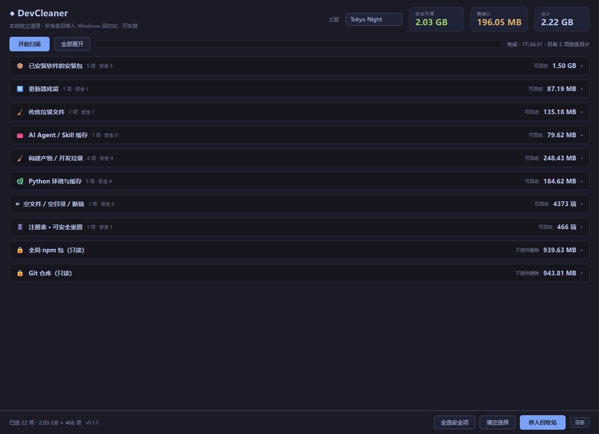

# Screenshots

The README carries one hero image; the rest live here. All captured from a real `v0.1.0` run
(Windows 11, 24 volumes).

> The UI speaks both Chinese and English — pick one in the top-right corner. Both sets are below.

## Every category on one screen

Everything is collapsed by default, so all 10 categories and their reclaimable sizes fit without
scrolling.

## Expanded

Click a header row or "Expand all". Four lines per item: name, path, the deciding signal, and why it's
safe.

## The confirmation dialog

Lists the first 40 items with name + size + full path, calls out every "needs review" item,
and — when registry items are included — prints the backup directory and the restore command.

## Registry

Displayed as an **entry count**, not bytes — these items are 0 bytes, so quoting KB would be
meaningless.

## A light theme, expanded

## All six themes

| | |
|---|---|
| **Studio Dark** — the Linear / Vercel / Raycast lineage | **Studio Light** |
|  |  |
| **Ink** — warm black and cream; the dark half of Editorial | **Paper** — warm off-white; the light half |
|  |  |
| **Rosé Pine** | **Tokyo Night** |
|  |  |

The primary colours are taken verbatim from
[palette-directions.html](palette-directions.html) (the original design file). Secondary text,
borders, and text-on-accent are all **computed from the WCAG formula**, so they follow along when
you change a primary colour.

## How these were captured

With `widget.grab()` on the widget directly — no mouse simulation. I tried
`SetForegroundWindow` plus synthetic clicks first; Windows refuses foreground changes, so the clicks
either got swallowed or landed twice and cancelled out.

The dialog shots use a `QTimer` inside `QMessageBox.exec()`'s nested event loop, then `reject()` the
dialog. **"Confirm" was never clicked and nothing was ever actually deleted.**

## What will drift

The images reflect `v0.1.0`. Expect these to change — the code wins over the docs:

- Category count and names (adding a scanner adds one)
- The measured sizes here (machine-specific)
- The default theme
