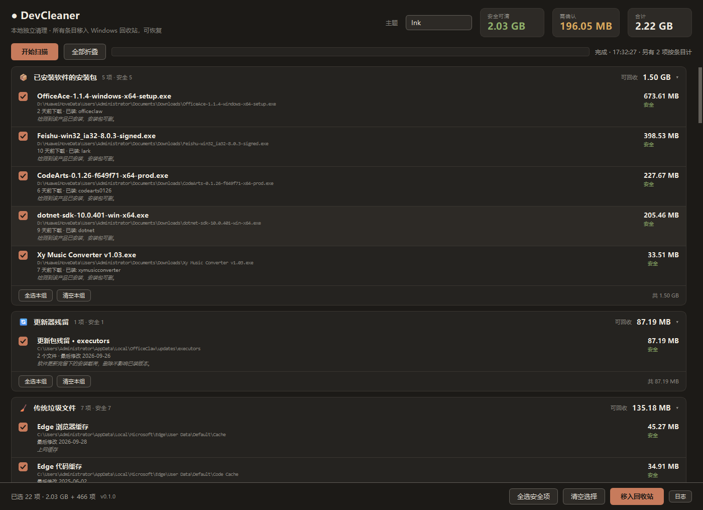

# 截图

README 只放一张主图，其余在这里。全部截自 `v0.1.0` 真实运行窗口（Windows 11，24 盘）。

> 界面文案硬编码中文，所以图是中文的。英文版见 [usage.en.md](usage.en.md)。

## 一屏看完所有分类

分类默认全部折叠，10 个分类和各自的可回收大小一屏放得下，不用一路往下翻。

## 展开细看

点标题行或「全部展开」。四行文字：名称、路径、判定依据、为什么能删。

## 清理前的确认弹窗

逐条列出前 40 项的名称 + 大小 + 完整路径，单独点名「需确认」项。含注册表项时会写出备份目录和还原命令。

## 注册表

按**条目数**显示，不按字节 —— 因为这类项体积是 0，拿 KB 糊弄人没意义。

## 浅色主题展开态

## 六套主题

| | |
|---|---|
| **Studio Dark** — Linear / Vercel / Raycast 那一脉 | **Studio Light** |
|  |  |
| **Ink** — 暖黑配奶白，Editorial 深色版 | **Paper** — 暖米白纸面，Editorial 浅色版 |
|  |  |
| **Rosé Pine** — 雾玫瑰 | **Tokyo Night** — 东京夜 |
|  |  |

主色原样取自 [palette-directions.html](palette-directions.html)（原始设计稿）。次级文字色、分割线、
强调色上的文字色都是按 WCAG 公式推导的 —— 改主色时它们会自动跟着走。

## 怎么截的

用 `widget.grab()` 直接抓控件，不做鼠标模拟（`SetForegroundWindow` 在 Windows 上经常被拒，
点击坐标对不上）。弹窗那几张用 `QTimer` 在 `QMessageBox.exec()` 的嵌套事件循环里抓，抓完
`reject()` —— **全程没有点过「确认」，没有真的删过任何东西**。

## 已知会变的地方

截图反映的是 `v0.1.0`。这些东西以后会变，图文不一致时以代码为准：

- 分类数量和名称（加扫描器就会多）
- 本机实测的容量（跟机器强相关）
- 默认主题
