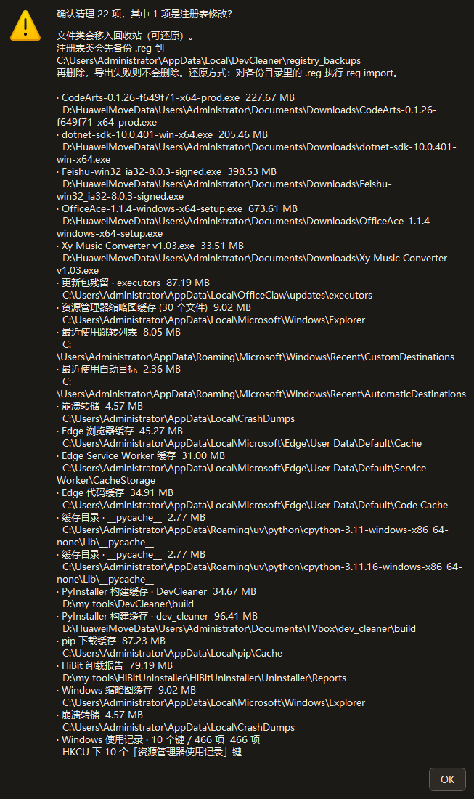

# 使用说明

README 讲「它是什么、能清什么」，这篇讲**怎么用好它**。

- [第一次用](#第一次用)
- [界面各部分](#界面各部分)
- [配置项逐条解释](#配置项逐条解释)
- [命令行](#命令行)
- [加一个扫描器](#加一个扫描器)
- [故障排查](#故障排查)
- [设计取舍](#设计取舍)

---

## 第一次用


1. 下载 `DevCleaner.exe`，双击。**它会自己开始扫描**，约 20~30 秒
2. 扫完先别急着删。**展开每个分类，看清楚判据对不对** —— 这是这个工具唯一需要你花时间的地方
3. 只读清单（🔒 图标）永远不会出现在清理列表里，它们只是给你看体积的
4. 想清就勾选，然后点「移入回收站」。**进回收站，可还原**

⚠️ 第一次用建议先手动清空一次回收站之外的东西，确认结果符合预期，再养成习惯。

### 想更谨慎一点

把 `settings.yaml` 里所有 `risk: safe` 改成 `caution`，这样默认一个都不勾选，每一项都要你手动确认。改完重启生效。

---

## 界面各部分

### 顶栏

| 元素 | 含义 |
|---|---|
| 安全可清 | 所有 `safe` 项的字节和。**默认已勾选** |
| 需确认 | 所有 `caution` 项的字节和。**默认不勾选** |
| 合计 | 两者之和 |
| 主题 | 6 套配色，实时切换，选择会记到 `settings.yaml` |

### 工具条

| 按钮 | 作用 |
|---|---|
| 重新扫描 | 重跑一次扫描。清理后想再找就点它 |
| 全部展开 / 全部折叠 | 10 个分类一眼看完，或全铺开细看 |

进度条在扫描期间是**走马灯**（不确定模式），不是百分比 —— 因为各项耗时差得很远，百分比会一直卡在某个数字上骗人。右侧文字会显示当前在扫哪一类。

### 分类卡片

标题行从左到右：图标、分类名、`N 项 · 安全 M`、可回收大小、`▸/▾`。

**点标题行展开/折叠。** 默认全部折叠 —— 10 个分类一屏放得下，不用一路往下翻。

展开后：

- `全选本组` / `清空本组` —— 只影响这一组
- 每行左侧复选框，右侧是大小和风险徽标（🟢 安全 / 🟡 需确认）
- 四行文字：名称、路径、判定依据、为什么能删

### 只读清单（🔒）

`全局 npm 包`、`Git 仓库` 这类**永远不提供删除**。它们存在的意义是让你知道「这东西占了多少」，判断该不该自己处理。

### 底栏

`已选 N 项 · 大小 + 条目数`。`+ 462 项` 表示其中有 462 项按条目计数（注册表、空文件这类体积为 0 的）。

### 确认弹窗



弹窗会：

- 逐条列出前 40 项的**名称 + 大小 + 完整路径**
- 单独点名所有「需确认」项
- 如果有注册表项，**明确写出备份目录和还原命令**
- 批量删除时会提醒条目数

这是最后一道关。看清楚了再点。

---

## 配置项逐条解释

`settings.yaml` 放在 exe 同目录。找不到就用包内内置副本。**改完重启生效，不用重新打包。**

```yaml
theme: "Ink"
```

界面右上角选主题时自动写入，不用手改。

```yaml
scan_roots:
  - "%USERPROFILE%"
```

**需要递归遍历的根目录。** 只影响三类扫描器：`.venv`、Git 仓库、构建产物/空文件。

加盘符会明显变慢 —— 本机 4 个根扫完约 25 秒，其中空文件那一项就占 11 秒（它必须全量遍历）。

```yaml
exclude_dirs:
  - "C:/Windows"
exclude_globs:
  - "**/node_modules/**"
```

白名单。命中就完全跳过，连统计都不做。

系统目录默认已排除（`C:/Windows`、`C:/Program Files`、`C:/Program Files (x86)`）。**不建议把别的开发目录也排除** —— 那会让扫描结果失真。

```yaml
installer_roots: []
```

安装包扫描目录。**留空 = 自动从 Windows 已知文件夹取 Downloads + Desktop**，并且能正确解析这些文件夹的重定向（很多人把 Documents 挪到 D 盘，直接写 `%USERPROFILE%\Downloads` 会找不到）。

```yaml
min_installer_age_days: 14
temp_min_age_days: 7
stale_clone_days: 60
```

三个天龄阈值。作用范围不一样：

| 键 | 管谁 |
|---|---|
| `min_installer_age_days` | 只管**未确认已装**的安装包。已确认已装的直接算 safe，不看年龄 |
| `temp_min_age_days` | 过期临时文件。目录里有 exe 在跑会额外标为需确认 |
| `stale_clone_days` | 无远程的本地 clone |

调小 `min_installer_age_days` 可以让刚下载的安装包也进列表 —— 但如果程序还没装完，删了就白下了。

```yaml
installed_aliases:
  OfficeAce: ["OfficeClaw"]
```

产品名匹配不上时的别名表。典型场景：安装包叫 `OfficeAce-1.1.4-setup.exe`，但程序实际装在 `%LOCALAPPDATA%\OfficeClaw`。

匹配流程：剥掉版本/平台/角色后缀得到产品名 → 先在进程名和安装目录里找 → 找不到再查这张表和卸载注册表。三处都命中才算「已装」。

```yaml
custom_cache:
  - name: "pip 下载缓存"
    path: "%LOCALAPPDATA%/pip/Cache"
    risk: safe
    note: "pip 下载的 wheel 缓存，删了重新下载即可。"
```

**加任何目录进来就是一条规则，零代码。** 这是最常用的扩展点。

- `name` 显示名
- `path` 支持 `%VAR%`，`/` 和 `\` 都行
- `risk` 取 `safe`（默认勾选）或 `caution`（不勾选 + 二次确认）
- `note` 会显示在「为什么能删」那一行

```yaml
extra_junk: []
```

追加传统垃圾目录，格式同 `custom_cache` 的前三项。

```yaml
agent_configs:
  - path: "%USERPROFILE%/.config/opencode/opencode.jsonc"
agent_cache_root: "%USERPROFILE%/.cache/opencode/packages"
```

AI Agent 缓存扫描的配置。`agent_configs` 里的文件会被解析出 `plugin` 数组，只有**不在这个列表里**的缓存包才会被报成「未启用的插件缓存」。

`.jsonc` 也能读（会剥掉 `//` 注释）。

```yaml
scan_options:
  max_recursion_depth: 10
  min_size_bytes: 2097152
```

- `max_recursion_depth` 递归上限。调小能提速，代价是漏掉深层目录
- `min_size_bytes` 小于此值的项不显示。**注册表和空文件类按条目数计，不受这个值影响**

---

## 命令行

`app.py` 不带界面，适合脚本化。

```bash
python app.py --version          # DevCleaner 0.1.0
python app.py --help

python app.py                     # 扫一遍并打印
python app.py --json              # JSON 输出
python app.py -c "注册表"          # 只跑某一类
python app.py -c "垃圾" --min-age 3   # 临时改天龄阈值，不动配置
```

`-c` 是子串匹配，不区分大小写。不匹配时会列出所有可用分类并以退出码 2 结束。

`--json` 的结构：

```json
{
  "version": "0.1.0",
  "log": ["已安装软件的安装包: 6 项 · 0.0s", "..."],
  "items": [
    {"name": "...", "category": "...", "path": "...",
     "size": 707788800, "unit": "bytes", "risk": "safe"}
  ],
  "notes": [{"name": "...", "kind": "全局 npm 包", "path": "...", "size": 537133056}]
}
```

`unit` 为 `count` 时 `size` 是**条目数**不是字节。

GUI 版也认 `--version` / `--help`。

---

## 加一个扫描器

```python
class MyScanner(Scanner):
    category, icon = "我的分类", "\U0001f9f0"

    def scan(self) -> List[Item]:
        return [mk(self.category, Path("C:/some/cache"), "显示名", "safe",
                   meta="最后修改 2026-09-28", note="为什么能删")]
```

塞进 `SCANNERS` 列表，界面自动多出一个折叠分组，**不用改 UI 代码**。

两条要求：

1. **`risk` 要诚实。** 拿不准就用 `caution`
2. **体积为 0 的类别（注册表、条目计数）设 `unit="count"`** —— 界面会按条目数显示，不拿字节数骗人

**但更重要的一条：改判据必须同时加测试。** 见 [CONTRIBUTING](CONTRIBUTING.md)。

---

## 故障排查

### 扫描特别慢

主要耗时在「空文件 / 空目录 / 断链」——它必须全量遍历。本机占 11 秒 / 25 秒。

想更快：

```yaml
scan_roots:            # 砍掉不关心的根
  - "D:/projects"      # 而不是整个 %USERPROFILE%
scan_options:
  max_recursion_depth: 6
```

或者 `empty_scan_dirs: false` 只查空文件不查空目录。

### 某个安装包没被认出来

界面上它的「判定依据」会写 `N 天前下载 · 未确认已安装`，归到需确认。原因通常是**没找到「已装」的证据**。

排查顺序：

1. 产品名剥后缀剥对了吗？`FooSetup-1.2.3-x64.exe` → `Foo`
2. 程序真的装了吗？在「已安装的应用」里能找到吗
3. 装到了非标准位置？在 `installed_aliases` 里加一条

### 删不掉，提示「被进程占用」

正常。清理前会检查占用，腾出的 exe、dll 或句柄都会跳过。关掉相关程序或重启后再扫一次。

### 提示「权限不足」

需要管理员权限。`HKLM` 下的系统级卸载项和 `Run` 分支属于这类。

不想提权就**不勾这些项** —— 它们本来也在「需确认」里，不勾就没事。

### 注册表备份在哪 / 怎么还原

备份目录：`%LOCALAPPDATA%\DevCleaner\registry_backups\<时间戳>_<类型>\`

```powershell
# 列出所有备份
Get-ChildItem "$env:LOCALAPPDATA\DevCleaner\registry_backups"

# 还原某个
reg import "$env:LOCALAPPDATA\DevCleaner\registry_backups\20260928_164512_MRU\MRU.reg"
```

`.reg` 双击也能导入（regedit 会弹确认框）。

### 主题切了但没生效

主题名必须精确匹配，大小写敏感。`settings.yaml` 里写了不存在的名字会退回 `Ink`。

合法值：`Studio Dark` `Studio Light` `Paper` `Ink` `Rosé Pine` `Tokyo Night`

### 中文显示成方块

系统缺 `Microsoft YaHei UI` 字体。理论上会自动 fallback，但某些精简版 Windows 会出问题。装一个中文字体即可。

### 打包出来的 exe 启动很慢

PyInstaller onefile 每次启动都要解压到 `%TEMP%`，约 1.5 MB/秒。嫌慢可以改成 `--onedir`（`dist\DevCleaner\` 整个目录一起拷），牺牲「单文件」换启动速度。

### 找不到 `Downloads` 目录

本机 `C:\Users\Administrator\Downloads` 不存在（Documents 被重定向到 D 盘了）。

工具会依次尝试：原生 API 拿已知文件夹 → 真实 Documents 目录下的 `Downloads` → `%USERPROFILE%\Downloads`。你也可以在 `installer_roots` 里直接写绝对路径。

---

## 设计取舍

这些是踩过坑之后定下来的，改动前建议先读 [CHANGELOG 的决策记录](CHANGELOG.md#决策记录)。

| 决定 | 原因 |
|---|---|
| 失效程序只认「卸载命令里的 exe 不存在」 | 曾经还用 `InstallLocation` 判断，**误报了一大片** —— 微信和 VS Installer 的 `Uninstall.exe` 明明还在，只是 `InstallLocation` 指向旧路径。删掉活程序的卸载项 = 以后再也卸不掉它 |
| Git 仓库默认只读 | 没有任何信号能可靠区分「临时 clone」和「你的在用项目」 |
| 不扫 Windows Temp 的新文件 | 本机 770 MB 全在 7 天内，其中 121 MB 是运行中的 PyInstaller 解包目录。年龄过滤在这里收益≈0 |
| 不碰 Prefetch | 删了让下次启动变慢，负收益 |
| 不遍历 `HKCR\CLSID` | 那里误删的代价是系统装不上程序 |
| 注册表清零先备份、导出失败就拒绝删 | 备份失败还继续删就失去了「可恢复」这个前提 |
| 勾选态用 QPalette 而非 `setObjectName`+`unpolish` | 后者让 Qt 重新解析整份样式表，自动全选 27 行 = 27 次全量重算连续触发，整窗闪动 |
| 配置回写逐行替换而非 `yaml.dump` | 后者会冲掉用户写的注释 |
| `build.bat` 纯 ASCII | cmd 按 OEM 代码页读 `.bat`，中文加 `&` 会被误解析 |
